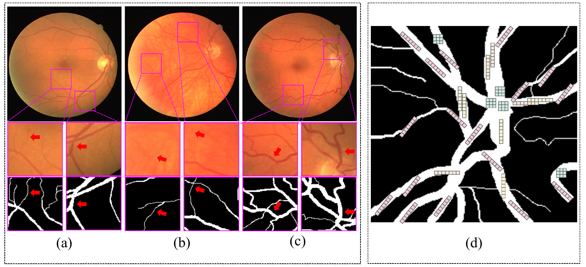
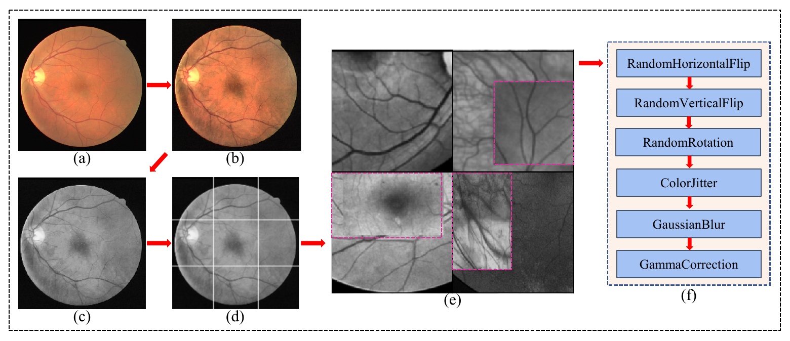
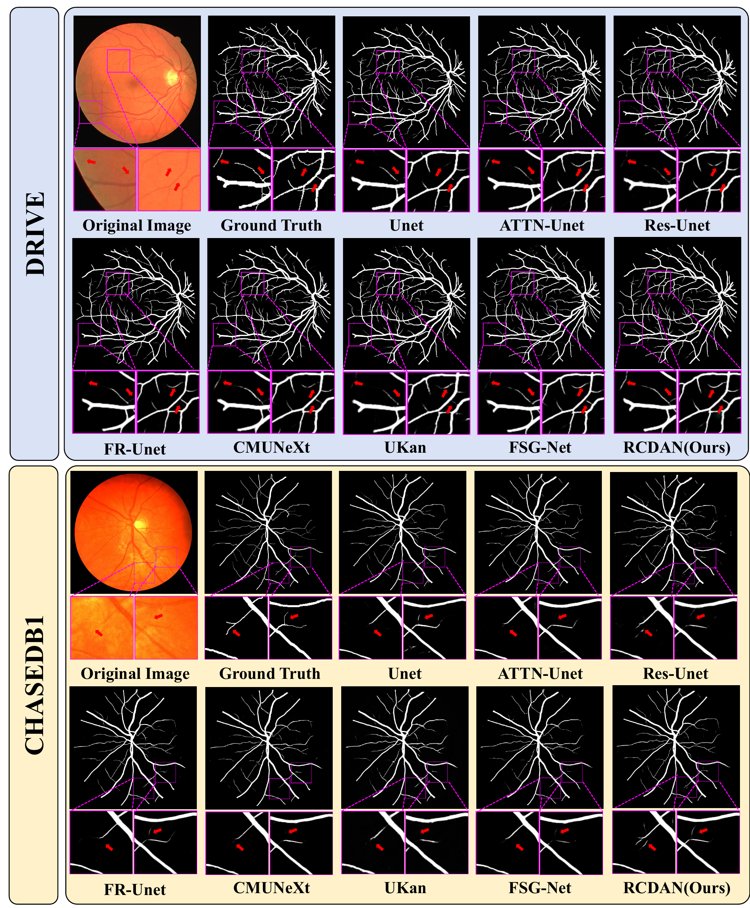
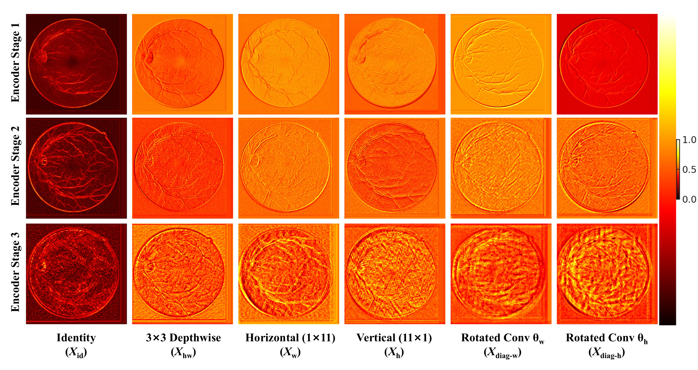

# RCDAN: A Novel Network for Retinal Vessel Segmentation with Rotational Convolution and Dynamic Attention

:pushpin: Official PyTorch implementation of **RCDAN: A Novel Network for Retinal Vessel Segmentation with Rotational Convolution and Dynamic Attention**.

[[`Paper`](#citation)] [[`Weights`](weights/README.md)]

---

## 🌟 Overview

**RCDAN** is an efficient retinal vessel segmentation network designed to capture thin, curvilinear, and low-contrast vascular structures while maintaining real-time inference speed.

The model integrates three core components:

- **Adaptive Rotated Inception Depthwise Convolution (ARIDC)** for orientation-aware vessel feature extraction.
- **Dynamic Selective Single-Head Vision Transformer (DS-SHViT)** for efficient global context modeling with sparse channel selection.
- **Unified Attention (UA)** for shared multi-scale feature recalibration across encoder stages.

<p align="center">
  
</p>
<p align="center"><b>Figure 1.</b> Overall architecture of RCDAN.</p>

---

## 💡 Key Highlights

- 🔹 **Rotational Vessel Modeling:** ARIDC uses analytical rotation on band-shaped depthwise kernels to better align with curvilinear retinal vessels.

- 🔹 **Efficient Global Attention:** DS-SHViT replaces redundant dense multi-head attention with single-head attention and a Top-k channel selection ratio of 0.5.

- 🔹 **Unified Multi-scale Attention:** UA computes shared attention weights across encoder features to improve cross-scale vessel representation.


---

## 🩻 Preprocessing

The experimental pipeline follows the paper settings:

- CLAHE is applied to enhance vessel contrast.
- Images are converted to grayscale.
- Training images are split into overlapping **224x224** patches with stride **112**.
- Testing is performed on the full original-resolution image without patch tiling.
- Training augmentation includes random flipping, rotation, color jittering, CutMix, Gaussian blur, and gamma correction.

<p align="center">
  
</p>
<p align="center"><b>Figure 2.</b> Preprocessing and augmentation examples used in the experiments.</p>

---

## 📈 Quantitative Results

### DRIVE and CHASEDB1

| Dataset | AUC (%) | Acc (%) | Sen (%) | IoU (%) |
|:--|:--:|:--:|:--:|:--:|
| DRIVE | **98.76** | 96.97 | **83.91** | **70.68** |
| CHASEDB1 | **99.06** | **97.64** | 84.89 | **69.41** |

### Efficiency

| Params (M) | FLOPs (G) | 
|:--:|:--:|
| 10.82 | 22.70 |

### Cross-dataset Generalization on STARE

| Training Dataset | AUC (%) | Acc (%) | Sen (%) | IoU (%) |
|:--|:--:|:--:|:--:|:--:|
| DRIVE -> STARE | **97.88** | **97.03** | **74.23** | **64.67** |
| CHASEDB1 -> STARE | 97.27 | **96.55** | **62.82** | **57.52** |

---

## 🩻 Qualitative Results

<p align="center">
  
</p>
<p align="center"><b>Figure 3.</b> Qualitative vessel segmentation results on DRIVE.</p>

<p align="center">
  
</p>
<p align="center"><b>Figure 4.</b> Qualitative vessel segmentation results on CHASEDB1.</p>

---

## ⚙️ Installation

The experiments in the paper were conducted with Python 3.9, PyTorch 2.3.0, CUDA 12.1, and an NVIDIA RTX 3090 GPU.

```bash
git clone <your-rcdan-repository-url>
cd RCDAN_release
conda create -n rcdan python=3.9
conda activate rcdan
pip install -r requirements.txt
```

---

## 🧩 Data Preparation

The preprocessing script supports DRIVE, CHASEDB1, and a generic paired image-mask layout.

### DRIVE

Expected raw structure:

```text
dataset/DRIVE/
  training/images/
  training/1st_manual/
  test/images/
  test/1st_manual/
```

Run:

```bash
python preprocess.py --name DRIVE --dataset dataset/DRIVE --mode all
```

### CHASEDB1

Expected raw structure:

```text
dataset/CHASEDB1/
  Image_01L.jpg
  Image_01L_1stHO.png
  ...
```

Run:

```bash
python preprocess.py --name CHASEDB1 --dataset dataset/CHASEDB1 --mode all
```

The generated files follow the original experiment format:

```text
dataset/DRIVE/
  training_pro/
    img_0.pkl
    gt_0.pkl
    img_patch_0.pkl
    gt_patch_0.pkl
    ...
  test_pro/
    img_0.pkl
    gt_0.pkl
    ...
```

---

## 🚀 Training and Evaluation

### Training

```bash
python train.py --dataset dataset/DRIVE --output-dir runs/drive
python train.py --dataset dataset/CHASEDB1 --output-dir runs/chasedb1
```

Default training settings match the paper: Adam optimizer, learning rate `1e-4`, 200 epochs, BCE + Dice loss, training patches of `224x224`, and stride `112`.

### Evaluation

Pretrained checkpoints are provided under `weights/` via Git LFS.

```bash
python test.py --dataset dataset/DRIVE --weights weights/rcdan_drive.pth
python test.py --dataset dataset/CHASEDB1 --weights weights/rcdan_chasedb1.pth
```

### Single-image Prediction

```bash
python predict.py --image examples/sample.png --weights weights/rcdan_drive.pth --output outputs/sample_pred.png
```

---

## 📦 Weights

Pretrained checkpoints are tracked with Git LFS:

```text
weights/
  rcdan_drive.pth
  rcdan_chasedb1.pth
```

If the files are not downloaded automatically after cloning, run:

```bash
git lfs pull
```

---

## 🛒 TODO

- [x] Release RCDAN model code
- [x] Release preprocessing, training, testing, and prediction scripts
- [x] Provide paper-aligned default training settings
- [x] Add pretrained checkpoints via Git LFS
- [ ] Add demo visualization scripts

---

## 🎈 Acknowledgements

We thank the open-source project [lseventeen/FR-UNet](https://github.com/lseventeen/FR-UNet), which provided valuable reference for the code structure and retinal vessel segmentation workflow.

---

## 📬 Contact

For questions, please open an issue in this repository.

---

## Citation

If this code is useful for your work, please cite our paper:

```bibtex
@article{rcdan2026,
  title={RCDAN: A Novel Network for Retinal Vessel Segmentation with Rotational Convolution and Dynamic Attention},
  author={},
  journal={},
  year={2026}
}
```
